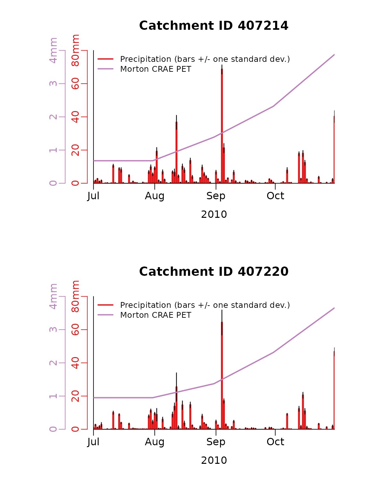
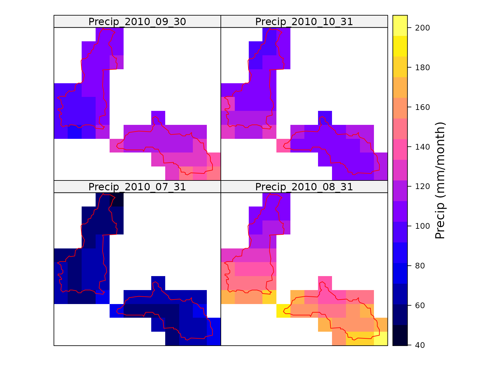
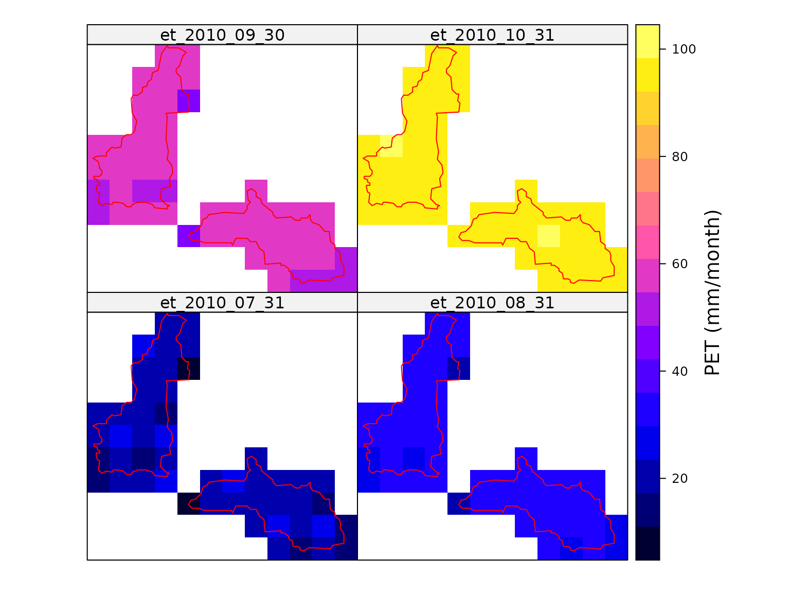
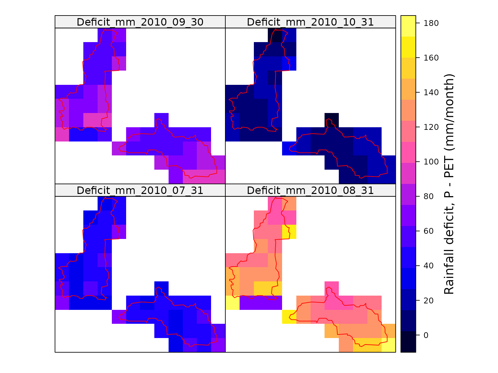
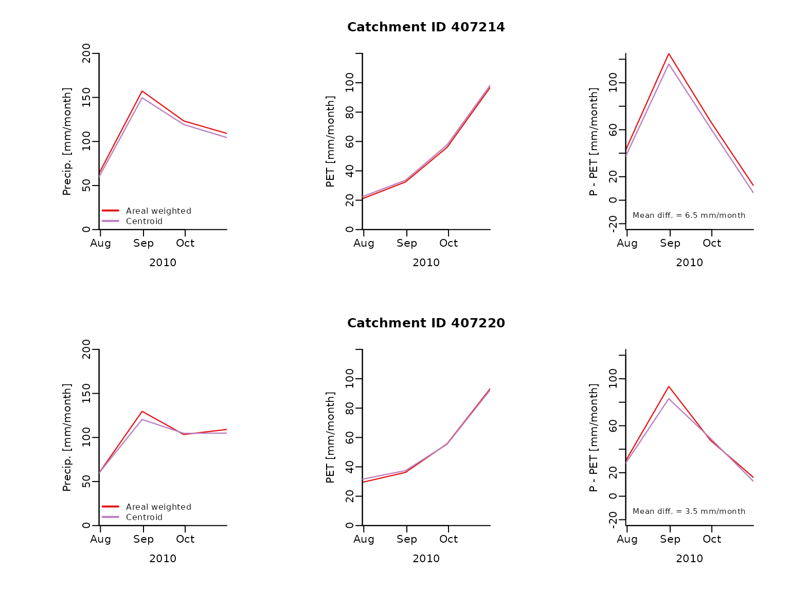

# Extract daily area weighted potential PET and precipitation and map

``` r
library(AWAPer, warn.conflicts = FALSE)
```

## Load extra packages for the vignette

The mapping of the results below requires the following packages.

``` r
library(raster)
#> Loading required package: sp
library(sp)
```

## Make netCDF files

The first step is to create the netCDF files. Here two netCDF files are
created (one for precip. temperature, vapour pressure deficit and a
second for solar radiation, which has a different grid geometry) and
only between the dates *update.from* and *update.to*. Importantly, these
two files (and those downloaded) are created in the working directory.

If the latter two dates were not input then data would be downloaded
from 1/1/1900 to two days ago. The netCDF files contain grids of the
daily data for all of Australia and is used below to extract data within
the catchment boundaries of interest.

Often users run *makeNetCDF_file* once to build netCDF data files that
contain all variables over the entire record length (which requires ~5GB
disk storage) and then use the netCDFs grids for multiple projects,
rather than re-building the netCDF for each project. Also, if
*makeNetCDF_file* is run with the the netCDF file names pointing to
existing files and *updateFrom=NA* then the netCDF files will be updated
to two days ago.

First, let’s define the start and end dates for data grids and the file
names.

``` r
date.from = as.Date("2010-07-01","%Y-%m-%d")
date.to = as.Date("2010-10-31","%Y-%m-%d")

ncdfFilename = tempfile(fileext='.nc')
ncdfSolarFilename = tempfile(fileext='.nc')
```

Next, let’s make the data grids over this period.

``` r
fnames = makeNetCDF_file(ncdfFilename = ncdfFilename,
                         ncdfSolarFilename = ncdfSolarFilename,
                         updateFrom = date.from,
                         updateTo = date.to)
#> Starting to build both netCDF files.
#> ... Testing downloading of AWAP precip. grid
#> ... Getting grid gemoetry from file.
#> ... Deleting /home/runner/work/AWAPer/AWAPer/vignettes/precip.20000101.grid.gz
#> ... Testing downloading of AWAP tmin grid
#> ... Testing downloading of AWAP tmax grid
#> ... Testing downloading of AWAP vapour pressure grid
#> ... Testing downloading of AWAP solar grid
#> ... Getting grid gemoetry from file.
#> ... Deleting /home/runner/work/AWAPer/AWAPer/vignettes/solarrad.20000101.grid.gz
#> ... Building AWAP netcdf file.
#>     NetCDF data will be updated from  2010-07-01  to  2010-10-31
#> ... Downloading non-solar data and importing to netcdf file:
#>     NetCDF Solar data will be updated from  2010-07-01  to  2010-10-31
#> ... Downloading solar data and importing to netcdf file:
#> Data construction FINISHED.
#> Total run time (DD:HH:MM:SS): 00:00:11:11
```

## Load a catchment boundary

Now that we have the meteorological data we can begin extracting data
for two catchments. Here the catchment boundaries built into the package
are used. However, shape files of polygons can easily be used once
imported into R. Here the data is imported into the *catchments*
variable.

``` r
data("catchments")
```

## Extract daily precipitation and PET data

Here the daily area weighted average precipitation and PET is extracted
across the two catchments. The data is extracted from the netCDF files
*ncdfFilename* and *ncdfSolarFilename*, between the dates *extract.from*
and *extract.to*. The other *AWAPer* variables *are* extracted because
they are need for the calculation of Morton’s PET. Note the netCDF files
must be in the working directory or the full file path must be given.

Here Morton’s wet-environment areal evapotranspiration was estimated
(other options are available). The use of Morton’s CREA formulation is
defined by setting the *ET.function* variable to *‘ET.MortonCRAE’*. The
calculation of the areal wet environment PET is defined by setting
Morton’s specific variable *ET.Mortons.est* to *‘wet areal ET’* (note,
other options exist within *AWAPer* for both variables). Lastly,
following [McMahon et al,
(2013)](https://hess.copernicus.org/articles/17/1331/2013/hess-17-1331-2013.pdf),
Morton’s PET is calculated at a monthly time step (not daily) to improve
its reliability. The monthly estimate is then interpolated to daily.

The estimation of ET uses the *evapotranspiration* package. It requires
a set of constants, which are loaded as follows.

``` r
data(constants,package='Evapotranspiration')
```

The area weighted daily meteorological variables and PET can then be
calculated as follows. Note, because only two months are being extracted
and , the default method to handle missing data and anomalies (e.g. Tmin
\> Tmax) during ET calculations is automatically changed from the
default of to .

``` r
climateData.daily = extractCatchmentData(ncdfFilename=ncdfFilename,
                      ncdfSolarFilename=ncdfSolarFilename,
                      extractFrom=date.from, extractTo=date.to,
                      locations=catchments, temporal.timestep = 'daily',
                      temporal.function.name='sum',spatial.function.name='var',
                      getTmin=T, getTmax=T, getVprp=T, getSolarrad=T, getET=T,
                      ET.function='ET.MortonCRAE', ET.timestep = 'monthly',
                      ET.Mortons.est='wet areal ET', ET.constants= constants)
#> Extraction data summary:
#>     NetCDF non-solar radiation climate data exists from 2010-07-01 to 2010-10-31
#>     NetCDF solar radiation data exists from 2010-07-01 to 2010-10-31
#>     Data will be extracted from  2010-07-01  to  2010-10-31  at  2  locations
#>     WARNING: The extraction duration is < 2 years and getET = TRUE.
#>              Hence, ET.missing_method and ET.abnormal_method is changed to "neighbouring average".
#> Starting data extraction:
#> ... Building catchment weights
#> ... Extracted DEM elevations from AWS.
#> Mosaicing & Projecting
#> Note: Elevation units are in meters
#> ... Starting to extract data across all locations:
#> ... Calculating mean daily solar radiation <1990-1-1
#> ... Linearly interpolating gaps in daily solar.
#> ... Calculating area weighted daily data.
#>     Working on ET for location 1 of 2
#>     Working on ET for location 2 of 2
#> Data extraction FINISHED.
#> Total run time (DD:HH:MM:SS): 00:00:00:27
```

Next time series of the extracted daily precipitation and PET for each
catchment is plotted. The precipitation plots show both the area
weighted estimate and the spatial variability on each day (as +/- one
standard deviation).

``` r
par(mfrow=c(2,1), mar =  c(5, 7.5, 4, 2.7) + 0.1)

# Loop through each catchment and plot the daily precipitation and PET.
for (i in 1:length(catchments$CatchID)) {

  filt = climateData.daily$catchmentTemporal.sum$CatchID == catchments$CatchID[i]

  # Convert year, month and day columns from extractions to a date.
  climateData.daily.date = as.Date(paste0(climateData.daily$catchmentTemporal.sum$year[filt], "-",
                           climateData.daily$catchmentTemporal.sum$month[filt], "-",
                           climateData.daily$catchmentTemporal.sum$day[filt]))


  # Plot precipitation and standard deviation against observations
  # ---------------------------------------------------------
  max.y = max(climateData.daily$catchmentTemporal.sum$precip_mm[filt] +
        sqrt(climateData.daily$catchmentSpatial.var$precip_mm[filt]))

  # Precipitation
  plot(climateData.daily.date,
        climateData.daily$catchmentTemporal.sum$precip_mm[filt],
        type = "h", col = "#e31a1c", lwd = 3, mgp = c(2, 0.5, 0),
        main=paste('Catchment ID',catchments$CatchID[i]),
        ylim = c(0, 80), ylab = "", xlab = "2010", xaxs = "i",
yaxt = "n", bty = "l", yaxs = "i")

  axis(side = 2, mgp = c(2, 0.5, 0), line = 0.5, at = seq(from = 0, to = 80, by = 20),
        labels = c("0", "20", "40", "60", "80mm"), col = "#e31a1c", col.axis = "#e31a1c")

  # Standard deviation
  for (j in 1:length(climateData.daily.date)) {
    x.plot = rep(climateData.daily.date[j], 2)
    y.plot = c(climateData.daily$catchmentTemporal.sum$precip_mm[filt][j] +
        sqrt(climateData.daily$catchmentSpatial.var$precip_mm[filt][j]),
        climateData.daily$catchmentTemporal.sum$precip_mm[filt][j] -
        sqrt(climateData.daily$catchmentSpatial.var$precip_mm[filt][j]))
    lines(x.plot, y.plot, col = "black", lwd = 1.2)
  }

  # Plot evap data.
  par(new = TRUE)
  plot(climateData.daily.date, climateData.daily$catchmentTemporal.sum$ET_mm[filt],
      col = "#bc80bd", lwd = 2, ylab = "", ylim = c(0, 4), lty = 1,
      xlab = "", xaxs = "i", yaxt = "n", xaxt = "n", type = "l", bty = "n", yaxs = "i")

  axis(side = 2, line = 2.3, mgp = c(2, 0.5, 0), labels = c("0", "1", "2", "3", "4mm"),
      at = seq(from = 0, to = 4, by = 1), col = "#bc80bd", col.axis = "#bc80bd")

  legend("topleft", cex = 0.8, lwd = 2, bty = "n", inset = c(0.01, -0.01),
      lty = c(1, 1), pch = c(NA, NA),
      col = c("#e31a1c",  "#bc80bd"),
      legend = c("Precipitation (bars +/- one standard dev.)", "Morton CRAE PET"), xpd = NA)
}
```



## Extract and map monthly total precipitation and PET

The meteorological spatial data can also be extracted at the required
timescale. Here the monthly total precipitation and PET across the two
catchments is mapped.

To extract the spatial data, and not some statistic of the spatial data
such as the sum, the variable *spatial.function.name* is set to *’’*.

To extract the monthly totals, *temporal.timestep* is set to *‘monthly’*
and *temporal.function.name* to *‘sum’*. For the former, the options are
*daily*, *weekly*, *monthly*, *quarterly* and *annual*. For the latter,
any built-in function or user-defined function that accepts a single
vector of data and returns a single number should work.

First let’s extract only precipitation *getPrecip* is set to \_TRUE and
*getTmin*, *getTmax*, *getVprp*, *getSolarrad* and *getET* are all set
to *FALSE*.

``` r
PrecipData.monthly = extractCatchmentData(ncdfFilename=ncdfFilename,
                     ncdfSolarFilename=ncdfSolarFilename,
                     extractFrom=date.from, extractTo=date.to,
                     locations=catchments,
                     getTmin = F, getTmax = F, getVprp = F,
                     getSolarrad = F, getET = F,
                     spatial.function.name = '',
                     temporal.timestep = 'monthly',
                     temporal.function.name = 'sum')
#> Extraction data summary:
#>     NetCDF non-solar radiation climate data exists from 2010-07-01 to 2010-10-31
#>     Data will be extracted from  2010-07-01  to  2010-10-31  at  2  locations
#> Starting data extraction:
#> ... Building catchment weights
#> ... Starting to extract data across all locations:
#> ... Calculating area weighted daily data.
#> Data extraction FINISHED.
#> Total run time (DD:HH:MM:SS): 00:00:00:05
```

The monthly total precipitation can then be mapped to show the spatial
variability.

``` r
v = list("sp.polygons", catchments, col = "red",first=FALSE)
colInd = which(startsWith(colnames(PrecipData.monthly@data), "Precip_"))
sp::spplot(PrecipData.monthly,colInd, sp.layout = list(v),
        colorkey = list(title = "Precip (mm/month)"))
```



Next let’s extract all variables and calculate the PET and then map.

``` r
metData.monthly = extractCatchmentData(ncdfFilename=ncdfFilename,
                     ncdfSolarFilename=ncdfSolarFilename,
                     extractFrom=date.from, extractTo=date.to,
                     locations=catchments,
                     spatial.function.name = '',
                     temporal.timestep = 'monthly',
                     temporal.function.name = 'sum',
                     getTmin=T, getTmax=T, getVprp=T, getSolarrad=T, getET=T,
                     ET.function='ET.MortonCRAE', ET.timestep = 'monthly',
                     ET.Mortons.est='wet areal ET', ET.constants= constants)
#> Extraction data summary:
#>     NetCDF non-solar radiation climate data exists from 2010-07-01 to 2010-10-31
#>     NetCDF solar radiation data exists from 2010-07-01 to 2010-10-31
#>     Data will be extracted from  2010-07-01  to  2010-10-31  at  2  locations
#>     WARNING: The extraction duration is < 2 years and getET = TRUE.
#>              Hence, ET.missing_method and ET.abnormal_method is changed to "neighbouring average".
#> Starting data extraction:
#> ... Building catchment weights
#> ... Extracted DEM elevations from AWS.
#> Mosaicing & Projecting
#> Note: Elevation units are in meters
#> ... Starting to extract data across all locations:
#> ... Calculating mean daily solar radiation <1990-1-1
#> ... Linearly interpolating gaps in daily solar.
#> ... Calculating area weighted daily data.
#>     Working on ET for location 1 of 2
#>     Working on ET for location 2 of 2
#> Data extraction FINISHED.
#> Total run time (DD:HH:MM:SS): 00:00:00:27
```

The monthly total PET can then be mapped to show the spatial
variability. The map below shows considerable spatial variability. Much
of this variability would not emerges if only point PET at the catchment
centroid was used.

``` r
colInd = which(startsWith(colnames(metData.monthly@data), "ET_mm"))
sp::spplot(metData.monthly,colInd, sp.layout = list(v),
  colorkey = list(title = "PET (mm/month)"))
```



Now that we have maps of the rainfall and PET, we can calculate and map
the monthly rainfall deficit.

``` r
colnames.all = colnames(metData.monthly@data)
colInd.P = which(startsWith(colnames.all, "Precip_"))
colInd.PET = which(startsWith(colnames.all, "ET_mm"))

for (i in 1:length(colInd.P)) {
  ind.P = colInd.P[i]
  ind.PET = colInd.PET[i]
  colname.P = colnames.all[ ind.P ]
  colname.tmp = sub('Precip_','Deficit_mm_',colname.P)
  metData.monthly[[colname.tmp]] = metData.monthly[[ind.P]] - metData.monthly[[ind.PET]]
}

colInd = which(startsWith(colnames(metData.monthly@data), "Deficit_mm_"))
sp::spplot(metData.monthly,colInd, sp.layout = list(v),
  colorkey = list(title = "Rainfall deficit (mm/month)"))
```



## Point versus area weighted rainfall deficit

Here area weighted catchment rainfall deficit estimates are compared to
point estimates at the centtoid of each catchment.

First, the centroids are estimated using the simple bounds box method.

``` r
centroid = matrix(0,2,2)

extn = extent(catchments[1,])
centroid[1,1] = extn@xmin + (extn@xmax - extn@xmin)/2
centroid[1,2] = extn@ymin + (extn@ymax - extn@ymin)/2

extn = extent(catchments[2,])
centroid[2,1] = extn@xmin + (extn@xmax - extn@xmin)/2
centroid[2,2] = extn@ymin + (extn@ymax - extn@ymin)/2
```

Then, the coordinates are converted to a spatial object and set
projection to GDA94.

``` r
coordinates.data = data.frame( ID = catchments$CatchID,
                               Longitude = centroid[,1],
                               Latitude =  centroid[,2])

sp::coordinates(coordinates.data) <- ~Longitude + Latitude

sp::proj4string(coordinates.data) = '+proj=longlat +ellps=GRS80 +no_defs'
```

Next, the meteorological data and PET are derived using both the area
weighted approach and centroids.

``` r
metData.monthly.weighted = extractCatchmentData(ncdfFilename=ncdfFilename,
                     ncdfSolarFilename=ncdfSolarFilename,
                     extractFrom=date.from, extractTo=date.to,
                     locations=catchments,
                     spatial.function.name = 'sum',
                     temporal.timestep = 'monthly',
                     temporal.function.name = 'sum',
                     getTmin=T, getTmax=T, getVprp=T, getSolarrad=T, getET=T,
                     ET.function='ET.MortonCRAE', ET.timestep = 'monthly',
                     ET.Mortons.est='wet areal ET', ET.constants= constants)
#> Extraction data summary:
#>     NetCDF non-solar radiation climate data exists from 2010-07-01 to 2010-10-31
#>     NetCDF solar radiation data exists from 2010-07-01 to 2010-10-31
#>     Data will be extracted from  2010-07-01  to  2010-10-31  at  2  locations
#>     WARNING: The extraction duration is < 2 years and getET = TRUE.
#>              Hence, ET.missing_method and ET.abnormal_method is changed to "neighbouring average".
#> Starting data extraction:
#> ... Building catchment weights
#> ... Extracted DEM elevations from AWS.
#> Mosaicing & Projecting
#> Note: Elevation units are in meters
#> ... Starting to extract data across all locations:
#> ... Calculating mean daily solar radiation <1990-1-1
#> ... Linearly interpolating gaps in daily solar.
#> ... Calculating area weighted daily data.
#>     Working on ET for location 1 of 2
#>     Working on ET for location 2 of 2
#> Data extraction FINISHED.
#> Total run time (DD:HH:MM:SS): 00:00:00:27

metData.monthly.centroid = extractCatchmentData(ncdfFilename=ncdfFilename,
                     ncdfSolarFilename=ncdfSolarFilename,
                     extractFrom=date.from, extractTo=date.to,
                     locations=coordinates.data,
                     temporal.timestep = 'monthly',
                     temporal.function.name = 'sum',
                     getTmin=T, getTmax=T, getVprp=T, getSolarrad=T, getET=T,
                     ET.function='ET.MortonCRAE', ET.timestep = 'monthly',
                     ET.Mortons.est='wet areal ET', ET.constants= constants)
#> Extraction data summary:
#>     NetCDF non-solar radiation climate data exists from 2010-07-01 to 2010-10-31
#>     NetCDF solar radiation data exists from 2010-07-01 to 2010-10-31
#>     Data will be extracted from  2010-07-01  to  2010-10-31  at  2  locations
#>     WARNING: The extraction duration is < 2 years and getET = TRUE.
#>              Hence, ET.missing_method and ET.abnormal_method is changed to "neighbouring average".
#> Starting data extraction:
#> ... Building catchment weights
#> ... Extracted DEM elevations from AWS.
#> Mosaicing & Projecting
#> Note: Elevation units are in meters
#> ... Starting to extract data across all locations:
#> ... Calculating mean daily solar radiation <1990-1-1
#> ... Linearly interpolating gaps in daily solar.
#> ... Calculating area weighted daily data.
#>     Working on ET for location 1 of 2
#>     Working on ET for location 2 of 2
#> Data extraction FINISHED.
#> Total run time (DD:HH:MM:SS): 00:00:00:23
```

Now let’s compare the two estimates of precipitation, PET and rainfall
deficit. The right most plots below show the the rainfall deficit. It
shows that using centroid estimate introduces errors of upto 6 mm/month
error.

``` r
par(mfrow=c(2,3), mar =  c(5, 7.5, 4, 2.7) + 0.1)

# Loop through each catchment and plot the daily precipitation and PET.
for (i in 1:length(catchments$CatchID)) {

  filt = metData.monthly.weighted$catchmentTemporal.sum$CatchID == catchments$CatchID[i]

  # Convert year, month and day columns from extractions to a date.
  metData.date = as.Date(paste0(metData.monthly.weighted$catchmentTemporal.sum$year[filt], "-",
       metData.monthly.weighted$catchmentTemporal.sum$month[filt], "-",
       metData.monthly.weighted$catchmentTemporal.sum$day[filt]))

  # Precipitation
  plot(metData.date,
       metData.monthly.weighted$catchmentTemporal.sum$precip_mm[filt],
       type = "l", col = "#e31a1c", lwd = 1.2, mgp = c(2, 0.5, 0),
       ylim = c(0, 200), ylab = "Precip. [mm/month]",
       xlab = "2010", xaxs = "i",
       bty = "l", yaxs = "i")

  lines(metData.date, metData.monthly.centroid$precip_mm[filt],
      col = "#bc80bd", lwd = 1.2)

  legend("bottomleft", cex = 0.8, lwd = 2, bty = "n", inset = c(0.01, -0.01),
       lty = c(1, 1), pch = c(NA, NA),
       col = c("#e31a1c",  "#bc80bd"),
       legend = c("Areal weighted", "Centroid"), xpd = NA)

  # PET
  plot(metData.date,
       metData.monthly.weighted$catchmentTemporal.sum$ET_mm[filt],
       type = "l", col = "#e31a1c", lwd = 1.2, mgp = c(2, 0.5, 0),
       main=paste('Catchment ID',catchments$CatchID[i]),
       ylim = c(0, 120), ylab = "PET [mm/month]",
       xlab = "2010", xaxs = "i",
       bty = "l", yaxs = "i")

  lines(metData.date, metData.monthly.centroid$ET_mm[filt],
        col = "#bc80bd", lwd = 1.2)

  # Deficit
  precip.deficit.weighted =  metData.monthly.weighted$catchmentTemporal.sum$precip_mm[filt] -
                    metData.monthly.weighted$catchmentTemporal.sum$ET_mm[filt]

  plot(metData.date, precip.deficit.weighted,
       type = "l", col = "#e31a1c", lwd = 1.2, mgp = c(2, 0.5, 0),
       ylim = c(-25, 125), ylab = "P - PET [mm/month]",
       xlab = "2010", xaxs = "i",
       bty = "l", yaxs = "i")

  precip.deficit.centroid =  metData.monthly.centroid$precip_mm[filt] -
                    metData.monthly.centroid$ET_mm[filt]

  lines(metData.date, precip.deficit.centroid, col = "#bc80bd", lwd = 1.2)

  text(x = par("usr")[1]+5, y = par("usr")[3]+10,
     labels = paste('Mean diff. =',round(mean(precip.deficit.weighted -
              precip.deficit.centroid),1),'mm/month'),
     adj = c(0, 0), cex=0.75)
}
```


