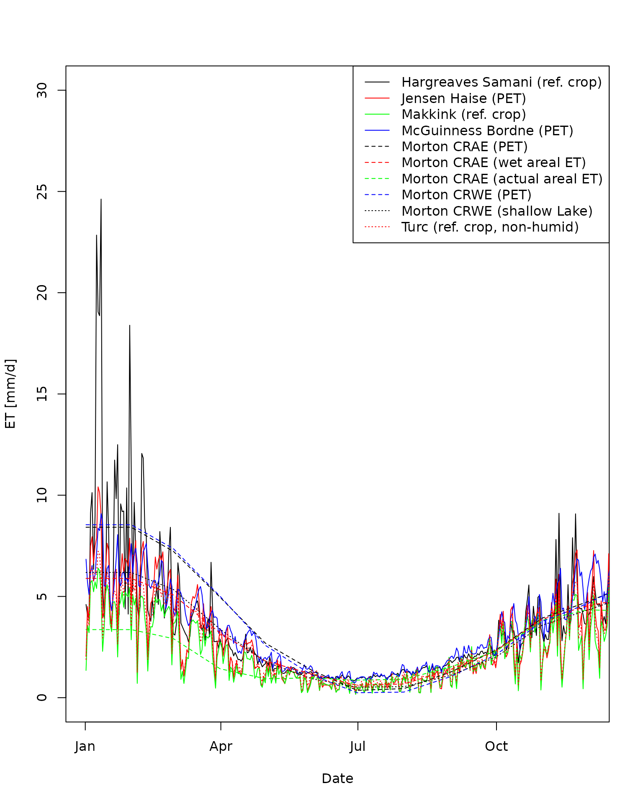

# Extract various measures of evapotranspiration

``` r
library(BOMcatchr, warn.conflicts = FALSE)
```

This example calculates and plot various estimates of
evaportranspiration. Ten different estimates of area weighted
evapotranspiration over one year at catchment 407214 (Victoria,
Australia) are derived. \## Make netCDF files Like the other vignettes,
the netCDF data grids need to be built.

First, let’s define the start and end dates for data grids and the file
names.

``` r
date.from = as.Date("2010-01-01","%Y-%m-%d")
date.to = as.Date("2010-12-31","%Y-%m-%d")

ncdfFilename = tempfile(fileext='.nc')
```

Next, let’s make the data grids over this period.

``` r
build.grids(ncdfFilename = ncdfFilename,
                   updateFrom = date.from,
                   updateTo = date.to,
                   vars = c('precip','tmin', 'tmax',
                   'vprp', 'solarrad'))
#> ... Testing downloading of each variable.
#>     Testing precip grid data.
#>     Testing tmin grid data.
#>     Testing tmax grid data.
#>     Testing vprp grid data.
#>     Testing solarrad grid data.
#> ... NetCDF file will be updated as follows:
#>        - New variables to add: precip  tmin  tmax  vprp  solarrad
#>        - Existing variables to modify: (none)
#>        - Data will be updated from  2010-01-01  to  2010-12-31
#> ... Downloading data for each variable and importing to netcdf file:
#> Data construction FINISHED.
#> Summary of time points successfully imported (and errors).
#>          Imported Errors
#> precip        365      0
#> tmin          365      0
#> tmax          365      0
#> vprp          365      0
#> solarrad      365      0
#> Total run time (DD:HH:MM:SS): 00:00:18:54
#> [1] "/tmp/RtmpYTHkCw/file2ea64510dbab.nc"
```

## Load a catchment boundary

Now that we have the meteorological data we can begin extracting data
for the catchment. Here the catchment boundaries built into the package
are used.

``` r
data("catchments")
```

## Extract daily precipitation and PET data

Next, the 11 different measures of evapotranspiration that can be
derived from the available gridded data are calculated for 12 months.

The estimation of ET uses the *evapotranspiration* package. It requires
a set of constants, which are loaded as follows.

``` r
data(constants,package='Evapotranspiration')
```

Next, all 11 ET measures are derived. For each measure, only the
following commands change: *ET.function* , *ET.timestep* and
*ET.Mortons.est* (when Morton’s estimate is derived).

``` r
climateData.ET.HargreavesSamani = extract.data(ncdfFilename= ncdfFilename,
                                extractFrom= date.from,
                                extractTo= date.to,
                                vars = c('tmax', 'tmin', 'et'),
                                locations=catchments,
                                spatial.function.name='IQR',
                                ET.function='ET.HargreavesSamani',
                                ET.timestep = 'daily',
                                ET.constants= constants)
#> Loading required namespace: sp
#> Extraction data summary:
#>     NetCDF climate data exists from 2010-01-01 to 2010-12-31
#>     Data will be extracted from  2010-01-01  to  2010-12-31  at  2  locations
#>     WARNING: The extraction duration is < 2 years and getET = TRUE.
#>              Hence, ET.missing_method and ET.abnormal_method is changed to "neighbouring average".
#> Starting data extraction:
#> ... Building catchment weights for each grid.
#> Loading required namespace: ncdf4
#> ... Extracted DEM elevations from AWS (using tmax coordinate and a GRS80 ellipsoid).
#> Mosaicing & Projecting
#> Note: Elevation units are in meters
#> ... Starting to extract data across all variable and locations:
#> ... Linearly interpolating gaps
#> ... Backfilling dates prior to the start of observations
#> ... Calculate daily ET at each grid cell.
#> ... Calculating area weighted results at required time-step.
#> Data extraction FINISHED.
#> Total run time (DD:HH:MM:SS): 00:00:00:28

climateData.ET.JensenHaise = extract.data(ncdfFilename= ncdfFilename,
                                extractFrom= date.from,
                                extractTo= date.to,
                                vars = c('tmax', 'tmin', 'solarrad', 'et'),
                                locations=catchments,
                                spatial.function.name='IQR',
                                ET.function='ET.JensenHaise',
                                ET.timestep = 'daily',
                                ET.constants= constants)
#> Extraction data summary:
#>     NetCDF climate data exists from 2010-01-01 to 2010-12-31
#>     Data will be extracted from  2010-01-01  to  2010-12-31  at  2  locations
#>     WARNING: The extraction duration is < 2 years and getET = TRUE.
#>              Hence, ET.missing_method and ET.abnormal_method is changed to "neighbouring average".
#> Starting data extraction:
#> ... Building catchment weights for each grid.
#> ... Extracted DEM elevations from AWS (using tmax coordinate and a GRS80 ellipsoid).
#> Mosaicing & Projecting
#> Note: Elevation units are in meters
#> ... Starting to extract data across all variable and locations:
#> ... Linearly interpolating gaps
#> ... Backfilling dates prior to the start of observations
#> ... Calculate daily ET at each grid cell.
#> ... Calculating area weighted results at required time-step.
#> Data extraction FINISHED.
#> Total run time (DD:HH:MM:SS): 00:00:00:46

climateData.ET.Makkink = extract.data(ncdfFilename= ncdfFilename,
                                extractFrom= date.from,
                                extractTo= date.to,
                                vars = c('tmax', 'tmin','solarrad', 'et'),
                                locations=catchments,
                                spatial.function.name='IQR',
                                ET.function='ET.Makkink',
                                ET.timestep = 'daily',
                                ET.constants= constants)
#> Extraction data summary:
#>     NetCDF climate data exists from 2010-01-01 to 2010-12-31
#>     Data will be extracted from  2010-01-01  to  2010-12-31  at  2  locations
#>     WARNING: The extraction duration is < 2 years and getET = TRUE.
#>              Hence, ET.missing_method and ET.abnormal_method is changed to "neighbouring average".
#> Starting data extraction:
#> ... Building catchment weights for each grid.
#> ... Extracted DEM elevations from AWS (using tmax coordinate and a GRS80 ellipsoid).
#> Mosaicing & Projecting
#> Note: Elevation units are in meters
#> ... Starting to extract data across all variable and locations:
#> ... Linearly interpolating gaps
#> ... Backfilling dates prior to the start of observations
#> ... Calculate daily ET at each grid cell.
#> ... Calculating area weighted results at required time-step.
#> Data extraction FINISHED.
#> Total run time (DD:HH:MM:SS): 00:00:00:45

climateData.ET.McGuinnessBordne = extract.data(ncdfFilename= ncdfFilename,
                               extractFrom= date.from,
                               extractTo= date.to,
                               vars = c('tmax', 'tmin', 'et'),
                               locations=catchments,
                               spatial.function.name='IQR',
                               ET.function='ET.McGuinnessBordne',
                               ET.timestep = 'daily',
                               ET.constants= constants)
#> Extraction data summary:
#>     NetCDF climate data exists from 2010-01-01 to 2010-12-31
#>     Data will be extracted from  2010-01-01  to  2010-12-31  at  2  locations
#>     WARNING: The extraction duration is < 2 years and getET = TRUE.
#>              Hence, ET.missing_method and ET.abnormal_method is changed to "neighbouring average".
#> Starting data extraction:
#> ... Building catchment weights for each grid.
#> ... Extracted DEM elevations from AWS (using tmax coordinate and a GRS80 ellipsoid).
#> Mosaicing & Projecting
#> Note: Elevation units are in meters
#> ... Starting to extract data across all variable and locations:
#> ... Linearly interpolating gaps
#> ... Backfilling dates prior to the start of observations
#> ... Calculate daily ET at each grid cell.
#> ... Calculating area weighted results at required time-step.
#> Data extraction FINISHED.
#> Total run time (DD:HH:MM:SS): 00:00:00:23

climateData.ET.MortonCRAE = extract.data(ncdfFilename= ncdfFilename,
                               extractFrom= date.from,
                               extractTo= date.to,
                               vars = c('tmax', 'tmin', 'precip', 'vprp', 'solarrad', 'et'),
                               locations=catchments,
                               spatial.function.name='IQR',
                               ET.function='ET.MortonCRAE',
                               ET.timestep = 'monthly',
                               ET.constants= constants)
#> Extraction data summary:
#>     NetCDF climate data exists from 2010-01-01 to 2010-12-31
#>     Data will be extracted from  2010-01-01  to  2010-12-31  at  2  locations
#>     WARNING: The extraction duration is < 2 years and getET = TRUE.
#>              Hence, ET.missing_method and ET.abnormal_method is changed to "neighbouring average".
#> Starting data extraction:
#> ... Building catchment weights for each grid.
#> ... Extracted DEM elevations from AWS (using tmax coordinate and a GRS80 ellipsoid).
#> Mosaicing & Projecting
#> Note: Elevation units are in meters
#> ... Starting to extract data across all variable and locations:
#> ... Linearly interpolating gaps
#> ... Backfilling dates prior to the start of observations
#> ... Calculate daily ET at each grid cell.
#> ... Calculating area weighted results at required time-step.
#> Data extraction FINISHED.
#> Total run time (DD:HH:MM:SS): 00:00:01:09

climateData.ET.MortonCRAE.potentialET = extract.data(ncdfFilename= ncdfFilename,
                               extractFrom= date.from,
                               extractTo= date.to,
                               vars = c('tmax', 'tmin', 'precip', 'vprp', 'solarrad', 'et'),
                               locations=catchments,
                               spatial.function.name='IQR',
                               ET.function='ET.MortonCRAE',
                               ET.timestep = 'monthly',
                               ET.Mortons.est='potential ET',
                               ET.constants= constants)
#> Extraction data summary:
#>     NetCDF climate data exists from 2010-01-01 to 2010-12-31
#>     Data will be extracted from  2010-01-01  to  2010-12-31  at  2  locations
#>     WARNING: The extraction duration is < 2 years and getET = TRUE.
#>              Hence, ET.missing_method and ET.abnormal_method is changed to "neighbouring average".
#> Starting data extraction:
#> ... Building catchment weights for each grid.
#> ... Extracted DEM elevations from AWS (using tmax coordinate and a GRS80 ellipsoid).
#> Mosaicing & Projecting
#> Note: Elevation units are in meters
#> ... Starting to extract data across all variable and locations:
#> ... Linearly interpolating gaps
#> ... Backfilling dates prior to the start of observations
#> ... Calculate daily ET at each grid cell.
#> ... Calculating area weighted results at required time-step.
#> Data extraction FINISHED.
#> Total run time (DD:HH:MM:SS): 00:00:01:11

climateData.ET.MortonCRAE.wetarealET = extract.data(ncdfFilename= ncdfFilename,
                                extractFrom= date.from,
                                extractTo= date.to,
                                vars = c('tmax', 'tmin', 'precip', 'vprp', 'solarrad', 'et'),
                                locations=catchments,
                                spatial.function.name='IQR',
                                ET.function='ET.MortonCRAE',
                                ET.timestep = 'monthly',
                                ET.Mortons.est='wet areal ET',
                                ET.constants= constants)
#> Extraction data summary:
#>     NetCDF climate data exists from 2010-01-01 to 2010-12-31
#>     Data will be extracted from  2010-01-01  to  2010-12-31  at  2  locations
#>     WARNING: The extraction duration is < 2 years and getET = TRUE.
#>              Hence, ET.missing_method and ET.abnormal_method is changed to "neighbouring average".
#> Starting data extraction:
#> ... Building catchment weights for each grid.
#> ... Extracted DEM elevations from AWS (using tmax coordinate and a GRS80 ellipsoid).
#> Mosaicing & Projecting
#> Note: Elevation units are in meters
#> ... Starting to extract data across all variable and locations:
#> ... Linearly interpolating gaps
#> ... Backfilling dates prior to the start of observations
#> ... Calculate daily ET at each grid cell.
#> ... Calculating area weighted results at required time-step.
#> Data extraction FINISHED.
#> Total run time (DD:HH:MM:SS): 00:00:01:14

climateData.ET.MortonCRAE.actualarealET = extract.data(ncdfFilename= ncdfFilename,
                                 extractFrom= date.from,
                                 extractTo= date.to,
                                 vars = c('tmax', 'tmin', 'precip', 'vprp', 'solarrad', 'et'),
                                 locations=catchments,
                                 spatial.function.name='IQR',
                                 ET.function='ET.MortonCRAE',
                                 ET.timestep = 'monthly',
                                 ET.Mortons.est='actual areal ET',
                                 ET.constants= constants)
#> Extraction data summary:
#>     NetCDF climate data exists from 2010-01-01 to 2010-12-31
#>     Data will be extracted from  2010-01-01  to  2010-12-31  at  2  locations
#>     WARNING: The extraction duration is < 2 years and getET = TRUE.
#>              Hence, ET.missing_method and ET.abnormal_method is changed to "neighbouring average".
#> Starting data extraction:
#> ... Building catchment weights for each grid.
#> ... Extracted DEM elevations from AWS (using tmax coordinate and a GRS80 ellipsoid).
#> Mosaicing & Projecting
#> Note: Elevation units are in meters
#> ... Starting to extract data across all variable and locations:
#> ... Linearly interpolating gaps
#> ... Backfilling dates prior to the start of observations
#> ... Calculate daily ET at each grid cell.
#> ... Calculating area weighted results at required time-step.
#> Data extraction FINISHED.
#> Total run time (DD:HH:MM:SS): 00:00:01:14

climateData.ET.MortonCRWE = extract.data(ncdfFilename= ncdfFilename,
                                 extractFrom= date.from,
                                 extractTo= date.to,
                                 vars = c('tmax', 'tmin', 'precip', 'vprp', 'solarrad', 'et'),
                                 locations=catchments,
                                 spatial.function.name='IQR',
                                 ET.function='ET.MortonCRWE',
                                 ET.timestep = 'monthly',
                                 ET.Mortons.est = 'potential ET',
                                 ET.constants= constants)
#> Extraction data summary:
#>     NetCDF climate data exists from 2010-01-01 to 2010-12-31
#>     Data will be extracted from  2010-01-01  to  2010-12-31  at  2  locations
#>     WARNING: The extraction duration is < 2 years and getET = TRUE.
#>              Hence, ET.missing_method and ET.abnormal_method is changed to "neighbouring average".
#> Starting data extraction:
#> ... Building catchment weights for each grid.
#> ... Extracted DEM elevations from AWS (using tmax coordinate and a GRS80 ellipsoid).
#> Mosaicing & Projecting
#> Note: Elevation units are in meters
#> ... Starting to extract data across all variable and locations:
#> ... Linearly interpolating gaps
#> ... Backfilling dates prior to the start of observations
#> ... Calculate daily ET at each grid cell.
#> ... Calculating area weighted results at required time-step.
#> Data extraction FINISHED.
#> Total run time (DD:HH:MM:SS): 00:00:01:10

climateData.ET.MortonCRWE.shallowLake = extract.data(ncdfFilename= ncdfFilename,
                                 extractFrom= date.from,
                                 extractTo= date.to,
                                 vars = c('tmax', 'tmin', 'precip', 'vprp', 'solarrad', 'et'),
                                 locations=catchments,
                                 spatial.function.name='IQR',
                                 ET.function='ET.MortonCRWE',
                                 ET.timestep = 'monthly',
                                 ET.Mortons.est = 'shallow lake ET',
                                 ET.constants= constants)
#> Extraction data summary:
#>     NetCDF climate data exists from 2010-01-01 to 2010-12-31
#>     Data will be extracted from  2010-01-01  to  2010-12-31  at  2  locations
#>     WARNING: The extraction duration is < 2 years and getET = TRUE.
#>              Hence, ET.missing_method and ET.abnormal_method is changed to "neighbouring average".
#> Starting data extraction:
#> ... Building catchment weights for each grid.
#> ... Extracted DEM elevations from AWS (using tmax coordinate and a GRS80 ellipsoid).
#> Mosaicing & Projecting
#> Note: Elevation units are in meters
#> ... Starting to extract data across all variable and locations:
#> ... Linearly interpolating gaps
#> ... Backfilling dates prior to the start of observations
#> ... Calculate daily ET at each grid cell.
#> ... Calculating area weighted results at required time-step.
#> Data extraction FINISHED.
#> Total run time (DD:HH:MM:SS): 00:00:01:11

climateData.ET.Turc = extract.data(ncdfFilename= ncdfFilename,
                                 extractFrom= date.from,
                                 extractTo= date.to,
                                 vars = c('tmax', 'tmin', 'solarrad', 'et'),
                                 locations=catchments,
                                 spatial.function.name='IQR',
                                 ET.function='ET.Turc',
                                 ET.timestep = 'daily',
                                 ET.constants= constants)
#> Extraction data summary:
#>     NetCDF climate data exists from 2010-01-01 to 2010-12-31
#>     Data will be extracted from  2010-01-01  to  2010-12-31  at  2  locations
#>     WARNING: The extraction duration is < 2 years and getET = TRUE.
#>              Hence, ET.missing_method and ET.abnormal_method is changed to "neighbouring average".
#> Starting data extraction:
#> ... Building catchment weights for each grid.
#> ... Extracted DEM elevations from AWS (using tmax coordinate and a GRS80 ellipsoid).
#> Mosaicing & Projecting
#> Note: Elevation units are in meters
#> ... Starting to extract data across all variable and locations:
#> ... Linearly interpolating gaps
#> ... Backfilling dates prior to the start of observations
#> ... Calculate daily ET at each grid cell.
#> ... Calculating area weighted results at required time-step.
#> Data extraction FINISHED.
#> Total run time (DD:HH:MM:SS): 00:00:00:46
```

Next each estimate is plotted over time.

``` r
filt = climateData.ET.HargreavesSamani$temporal.mean$Location.ID==407214
d = ISOdate(climateData.ET.HargreavesSamani$temporal.mean$year,
            climateData.ET.HargreavesSamani$temporal.mean$month,
            climateData.ET.HargreavesSamani$temporal.mean$day)
plot(d[filt], climateData.ET.HargreavesSamani$temporal.mean$et[filt],
            col='black',lty=1, xlim = c(ISOdate(2010,1,1), ISOdate(2010,12,1)),
            ylim=c(0, 30),type='l', ylab='ET [mm/d]',xlab='Date')

filt = climateData.ET.JensenHaise$temporal.mean$Location.ID==407214
d = ISOdate(climateData.ET.JensenHaise$temporal.mean$year,
            climateData.ET.JensenHaise$temporal.mean$month,
            climateData.ET.JensenHaise$temporal.mean$day)
lines(d[filt], climateData.ET.JensenHaise$temporal.mean$et[filt],
            col='red',lty=1)

filt = climateData.ET.Makkink$temporal.mean$Location.ID==407214
d = ISOdate(climateData.ET.Makkink$temporal.mean$year,
            climateData.ET.Makkink$temporal.mean$month,
            climateData.ET.Makkink$temporal.mean$day)
lines(d[filt], climateData.ET.Makkink$temporal.mean$et[filt],
            col='green',lty=1)

filt = climateData.ET.McGuinnessBordne$temporal.mean$Location.ID==407214
d = ISOdate(climateData.ET.McGuinnessBordne$temporal.mean$year,
            climateData.ET.McGuinnessBordne$temporal.mean$month,
            climateData.ET.McGuinnessBordne$temporal.mean$day)
lines(d[filt], climateData.ET.McGuinnessBordne$temporal.mean$et[filt],
            col='blue',lty=1)

filt = climateData.ET.MortonCRAE.potentialET$temporal.mean$Location.ID==407214
d = ISOdate(climateData.ET.MortonCRAE.potentialET$temporal.mean$year,
            climateData.ET.MortonCRAE.potentialET$temporal.mean$month,
            climateData.ET.MortonCRAE.potentialET$temporal.mean$day)
lines(d[filt], climateData.ET.MortonCRAE.potentialET$temporal.mean$et[filt],
            col='black',lty=2)

filt = climateData.ET.MortonCRAE.wetarealET$temporal.mean$Location.ID==407214
d = ISOdate(climateData.ET.MortonCRAE.wetarealET$temporal.mean$year,
            climateData.ET.MortonCRAE.wetarealET$temporal.mean$month,
            climateData.ET.MortonCRAE.wetarealET$temporal.mean$day)
lines(d[filt], climateData.ET.MortonCRAE.wetarealET$temporal.mean$et[filt],
            col='red',lty=2)

filt = climateData.ET.MortonCRAE.actualarealET$temporal.mean$Location.ID==407214
d = ISOdate(climateData.ET.MortonCRAE.actualarealET$temporal.mean$year,
            climateData.ET.MortonCRAE.actualarealET$temporal.mean$month,
            climateData.ET.MortonCRAE.actualarealET$temporal.mean$day)
lines(d[filt], climateData.ET.MortonCRAE.actualarealET$temporal.mean$et[filt],
            col='green',lty=2)

filt = climateData.ET.MortonCRWE$temporal.mean$Location.ID==407214
d = ISOdate(climateData.ET.MortonCRWE$temporal.mean$year,
            climateData.ET.MortonCRWE$temporal.mean$month,
            climateData.ET.MortonCRWE$temporal.mean$day)
lines(d[filt], climateData.ET.MortonCRWE$temporal.mean$et[filt],
            col='blue',lty=2)

filt = climateData.ET.MortonCRWE.shallowLake$temporal.mean$Location.ID==407214
d = ISOdate(climateData.ET.MortonCRWE.shallowLake$temporal.mean$year,
            climateData.ET.MortonCRWE.shallowLake$temporal.mean$month,
            climateData.ET.MortonCRWE.shallowLake$temporal.mean$day)
lines(d[filt], climateData.ET.MortonCRWE.shallowLake$temporal.mean$et[filt],
            col='black',lty=3)

filt = climateData.ET.Turc$temporal.mean$Location.ID==407214
d = ISOdate(climateData.ET.Turc$temporal.mean$year,
            climateData.ET.Turc$temporal.mean$month,
            climateData.ET.Turc$temporal.mean$day)
lines(d[filt], climateData.ET.Turc$temporal.mean$et[filt],
            col='red',lty=3)

legend(x='topright', legend=c(
  'Hargreaves Samani (ref. crop)',
  'Jensen Haise (PET)',
  'Makkink (ref. crop)',
  'McGuinness Bordne (PET)',
  'Morton CRAE (PET)',
  'Morton CRAE (wet areal ET)',
  'Morton CRAE (actual areal ET)',
  'Morton CRWE (PET)',
  'Morton CRWE (shallow Lake)',
  'Turc (ref. crop, non-humid)'),
  lty = c(1,1,1,1,2,2,2,2,3,3),
  col=c('black','red','green','blue','black','red','green','blue','black','red')
)
```


