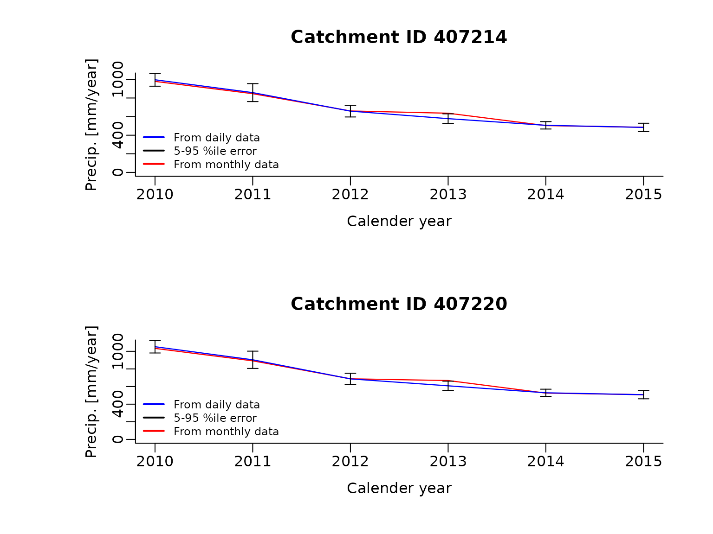
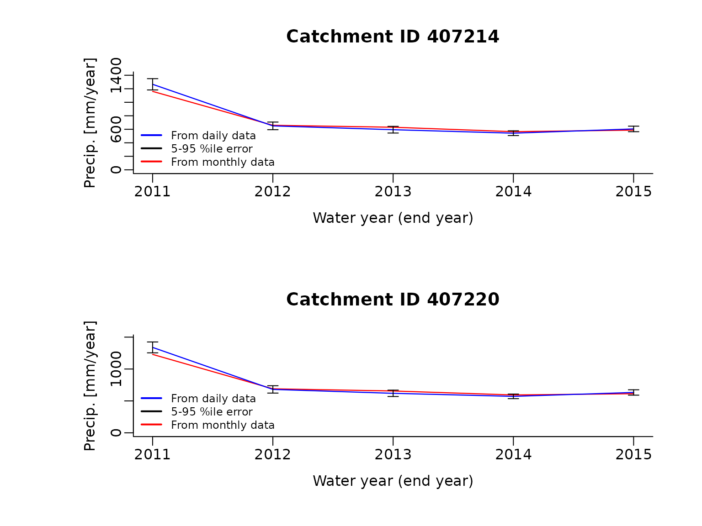

# Extract water year area weighted precipitation

``` r
library(BOMcatchr, warn.conflicts = FALSE)
```

## Make netCDF files

The first step is to create the netCDF file. Here grids are build for
monthly precipitation, daily precipitation and the daily root measure
square error (RMSE) from the interpolation of the rain gauge data - and
only between the dates *update.from* and *update.to*.

First, let’s define the start and end dates for data grids and the file
names.

``` r
date.from = as.Date("2010-01-01","%Y-%m-%d")
date.to = as.Date("2015-12-31","%Y-%m-%d")

ncdfFilename = tempfile(fileext='.nc')
```

Next, let’s make the data grids over this period. Note, the monthly root
mean square interpolation error (RMSE) gridded data is not provided the
Bureau of Meteorology and is therefore not able to be used below.

``` r
fname = build.grids(ncdfFilename = ncdfFilename,
                         updateFrom = date.from,
                         updateTo = date.to,
                         vars = c('precip', 'precip.RMSE', 'precip.monthly'))
#> ... Testing downloading of each variable.
#>     Testing precip grid data.
#>     Testing precip.RMSE grid data.
#>     Testing precip.monthly grid data.
#> ... NetCDF file will be updated as follows:
#>        - New variables to add: precip  precip.RMSE  precip.monthly
#>        - Existing variables to modify: (none)
#>        - Data will be updated from  2010-01-01  to  2015-12-31
#> ... Downloading data for each variable and importing to netcdf file:
#> Warning in file.remove(file.path(workingFolder, zip.fnames[!ind])): cannot
#> remove file '/tmp/Rtmp6gZwcB/986091 2020-08-29 00:31', reason 'No such file or
#> directory'
#> Warning in file.remove(file.path(workingFolder, zip.fnames[!ind])): cannot
#> remove file '/tmp/Rtmp6gZwcB/976111 2020-08-29 00:32', reason 'No such file or
#> directory'
#> Warning in file.remove(file.path(workingFolder, zip.fnames[!ind])): cannot
#> remove file '/tmp/Rtmp6gZwcB/931641 2020-08-29 00:44', reason 'No such file or
#> directory'
#> Warning in file.remove(file.path(workingFolder, zip.fnames[!ind])): cannot
#> remove file '/tmp/Rtmp6gZwcB/924657 2020-08-29 00:58', reason 'No such file or
#> directory'
#> Warning in file.remove(file.path(workingFolder, zip.fnames[!ind])): cannot
#> remove file '/tmp/Rtmp6gZwcB/996250 2020-08-29 01:11', reason 'No such file or
#> directory'
#> Warning in file.remove(file.path(workingFolder, zip.fnames[!ind])): cannot
#> remove file '/tmp/Rtmp6gZwcB/973278 2020-08-29 01:12', reason 'No such file or
#> directory'
#> Warning in file.remove(file.path(workingFolder, zip.fnames[!ind])): cannot
#> remove file '/tmp/Rtmp6gZwcB/998987 2020-08-29 01:13', reason 'No such file or
#> directory'
#> Warning in file.remove(file.path(workingFolder, zip.fnames[!ind])): cannot
#> remove file '/tmp/Rtmp6gZwcB/944133 2020-08-29 01:24', reason 'No such file or
#> directory'
#> Data construction FINISHED.
#> Summary of time points successfully imported (and errors).
#>                Imported Errors
#> precip             2191      0
#> precip.RMSE        2191      0
#> precip.monthly       72      0
#> Total run time (DD:HH:MM:SS): 00:00:44:23
```

## Load a catchment boundary

Now that we have the meteorological data we can begin extracting data
for two catchments. Here the catchment boundaries built into the package
are used.

``` r
data("catchments")
```

## Extract calendar year precipitation

Next let’s extract the calendar year area weighted total precipitation
across the two catchments. The data is extracted between the dates
*extract.from* and *extract.to*. Because the output time step can be
estimated from both the daily and monthly source data, both can be
extracted at the same time.

``` r
climateData.annual = extract.data(ncdfFilename=ncdfFilename,
                      extractFrom=date.from,
                      extractTo=date.to,
                      vars = c('precip', 'precip.monthly'),
                      locations=catchments,
                      temporal.timestep = 'annual',
                      temporal.function.name='sum',
                      spatial.function.name='var')
#> Loading required namespace: sp
#> Extraction data summary:
#>     NetCDF climate data exists from 2010-01-01 to 2015-12-31
#>     Data will be extracted from  2010-01-01  to  2015-12-31  at  2  locations
#> Starting data extraction:
#> ... Building catchment weights for each grid.
#> Loading required namespace: ncdf4
#> ... Starting to extract data across all variable and locations:
#> ... Linearly interpolating gaps
#> ... Backfilling dates prior to the start of observations
#> ... Calculating area weighted results at required time-step.
#> Data extraction FINISHED.
#> Total run time (DD:HH:MM:SS): 00:00:01:03
```

Now let’s also estimate the uncertainty in the calender year rainfall
using the root mean square interpolation error (RMSE). Specifically, we
are assuming that the error is unbiased, which allows us to assume the
RMSE equals the standard deviation. Taking the square of it gives us the
variance, which we can sum over the water year. Once all of the calender
year data is extracted, the total annual precipitation is plotted.

``` r
sqrd.sum <- function(x) {return(sum(x^2))}

climateData.annual.err = extract.data(ncdfFilename=ncdfFilename,
                      extractFrom=date.from,
                      extractTo=date.to,
                      vars = c('precip.RMSE'),
                      locations=catchments,
                      temporal.timestep = 'annual',
                      temporal.function.name = sqrd.sum,
                      spatial.function.name = 'var')
#> Extraction data summary:
#>     NetCDF climate data exists from 2010-01-01 to 2015-12-31
#>     Data will be extracted from  2010-01-01  to  2015-12-31  at  2  locations
#> Starting data extraction:
#> ... Building catchment weights for each grid.
#> ... Starting to extract data across all variable and locations:
#> ... Linearly interpolating gaps
#> ... Backfilling dates prior to the start of observations
#> ... Calculating area weighted results at required time-step.
#> Data extraction FINISHED.
#> Total run time (DD:HH:MM:SS): 00:00:00:53
```

``` r
par(mfrow=c(2,1), mar =  c(5, 7.5, 4, 2.7) + 0.1)

# Loop through each catchment and plot the daily precipitation and PET.
for (i in 1:length(catchments$CatchID)) {

  filt = climateData.annual$temporal.sum$Location.ID == catchments$CatchID[i]

  # Plot precipitation from monthly data
  tmp.date = climateData.annual$temporal.sum[filt,]
  x.data = tmp.date$year
  y.data = tmp.date$precip.monthly

  # Plot calendar year precipitation from daily data
  plot(x = x.data,
       y = y.data,
       type = "l",
       col = "red",
       lwd = 1.2,
       mgp = c(2, 0.5, 0),
       ylim = c(0, ceiling(max(y.data) * 1.05)),
       ylab = "Precip. [mm/year]",
       xlab = "Calender year",
       xaxs = "r",
       bty = "l",
       yaxs = "r",
       main=paste('Catchment ID',catchments$CatchID[i]))

  # Get water year data from daily data
  tmp.date = climateData.annual$temporal.sum[filt,]
  y.data = tmp.date$precip
  tmp.date = climateData.annual.err$temporal.sqrd.sum[filt,]
  y.data.low = y.data - 2*sqrt(tmp.date$precip.RMSE)
  y.data.hi = y.data + 2*sqrt(tmp.date$precip.RMSE)

  lines(x = x.data,
       y = y.data,
       type = "l",
       col = "blue",
       lwd = 1.2)

  # Add interpolation error bars for water years precipitation from daily data
  arrows(x0 = x.data,
         y0 = y.data.low,
         x1 = x.data,
         y1 = y.data.hi,
         angle=90,
         code=3,
         length=0.06,
         col="black")

  # Add legend
  legend("bottomleft",
         lwd = 2,
         bty = "n",
         inset = c(0.01, -0.01),
         lty = c(1, 1, 1), pch = c(NA, NA, NA),
         col = c("blue",  "black", "red"),
         legend = c("From daily data", "5-95 %ile error", "From monthly data"),
         xpd = NA,
         cex=0.75)
}
```



## Extract water year precipitation

Alternatively the water-year area weighted total precipitation cn be
extracted. To do this, an index to start of each water year is required.
Here the water year starts on the first of March. Note, the same
approach can be used to extract data over other time steps, such as
seasonal.

``` r
dates = seq.Date(date.from, date.to, by ='day')
wateryear.ind = which(as.numeric(format(dates, '%m')) == 3 & as.numeric(format(dates, '%d'))==1)
```

``` r
climateData.daily2wateryear = extract.data(ncdfFilename=ncdfFilename,
                      extractFrom=date.from,
                      extractTo=date.to,
                      vars = c('precip'),
                      locations=catchments,
                      temporal.timestep = wateryear.ind,
                      temporal.function.name='sum',
                      spatial.function.name='var')
#> Extraction data summary:
#>     NetCDF climate data exists from 2010-01-01 to 2015-12-31
#>     Data will be extracted from  2010-01-01  to  2015-12-31  at  2  locations
#> Starting data extraction:
#> ... Building catchment weights for each grid.
#> ... Starting to extract data across all variable and locations:
#> ... Linearly interpolating gaps
#> ... Backfilling dates prior to the start of observations
#> ... Calculating area weighted results at required time-step.
#> Data extraction FINISHED.
#> Total run time (DD:HH:MM:SS): 00:00:00:54
```

Now let’s estimate the uncertainty in the water year rainfall using the
root mean square interpolation error (RMSE).

``` r
climateData.daily2wateryear.err = extract.data(ncdfFilename=ncdfFilename,
                      extractFrom=date.from,
                      extractTo=date.to,
                      vars = c('precip.RMSE'),
                      locations=catchments,
                      temporal.timestep = wateryear.ind,
                      temporal.function.name = sqrd.sum,
                      spatial.function.name = 'var')
#> Extraction data summary:
#>     NetCDF climate data exists from 2010-01-01 to 2015-12-31
#>     Data will be extracted from  2010-01-01  to  2015-12-31  at  2  locations
#> Starting data extraction:
#> ... Building catchment weights for each grid.
#> ... Starting to extract data across all variable and locations:
#> ... Linearly interpolating gaps
#> ... Backfilling dates prior to the start of observations
#> ... Calculating area weighted results at required time-step.
#> Data extraction FINISHED.
#> Total run time (DD:HH:MM:SS): 00:00:00:53
```

Finally, let’s also extract the water year using the monthly gridded
precipitation data.

``` r
dates = seq.Date(date.from, date.to, by ='month')
wateryear.ind = which(as.numeric(format(dates, '%m')) == 3 & as.numeric(format(dates, '%d'))==1)
```

``` r
climateData.month2wateryear = extract.data(ncdfFilename=ncdfFilename,
                      extractFrom=date.from,
                      extractTo=date.to,
                      vars = c('precip.monthly'),
                      locations=catchments,
                      temporal.timestep = wateryear.ind,
                      temporal.function.name='sum',
                      spatial.function.name='var')
#> Extraction data summary:
#>     NetCDF climate data exists from 2010-01-01 to 2015-12-31
#>     Data will be extracted from  2010-01-01  to  2015-12-31  at  2  locations
#> Starting data extraction:
#> ... Building catchment weights for each grid.
#> ... Starting to extract data across all variable and locations:
#> ... Linearly interpolating gaps
#> ... Backfilling dates prior to the start of observations
#> ... Calculating area weighted results at required time-step.
#> Data extraction FINISHED.
#> Total run time (DD:HH:MM:SS): 00:00:00:02
```

Before plotting the water year data, the time steps with less than a
full water year of data are filtered out.

``` r
filt = climateData.daily2wateryear$temporal.sum$days.per.timestep >= 365
climateData.daily2wateryear$temporal.sum = climateData.daily2wateryear$temporal.sum[filt, ]

filt = climateData.daily2wateryear.err$temporal.sqrd.sum$days.per.timestep >= 365
climateData.daily2wateryear.err$temporal.sqrd.sum = climateData.daily2wateryear.err$temporal.sqrd.sum[filt, ]

filt = climateData.month2wateryear$temporal.sum$months.per.timestep == 12
climateData.month2wateryear$temporal.sum = climateData.month2wateryear$temporal.sum[filt, ]
```

Now let’s compare the two estimates of water year precipitation at the
two catchments. The blue line shows the water year total rainfall
calculated from the daily data, with the black vertical bars denoting
the estimated 5th to 95th error from the interpolation of rain gauges.
The red line shows the the water year total rainfall calculated from the
monthly data.

``` r
par(mfrow=c(2,1), mar =  c(5, 7.5, 4, 2.7) + 0.1)

# Loop through each catchment and plot the daily precipitation and PET.
for (i in 1:length(catchments$CatchID)) {

  # Water years precipitation from monthly data.
  filt = climateData.month2wateryear$temporal.sum$Location.ID == catchments$CatchID[i]
  tmp.date = climateData.month2wateryear$temporal.sum[filt,]
  x.data = tmp.date$year
  y.data = tmp.date$precip.monthly

  plot(x = x.data,
       y = y.data,
       type = "l",
       col = "red",
       lwd = 1.2,
       mgp = c(2, 0.5, 0),
       ylim = c(0, ceiling(max(y.data) * 1.1)),
       ylab = "Precip. [mm/year]",
       xlab = "Water year (end year)",
       xaxs = "r",
       bty = "l",
       yaxs = "r",
       main=paste('Catchment ID',catchments$CatchID[i]))

  # Get water year data from daily data.
  filt = climateData.daily2wateryear$temporal.sum$Location.ID == catchments$CatchID[i]
  tmp.date = climateData.daily2wateryear$temporal.sum[filt,]
  x.data = tmp.date$year
  y.data = tmp.date$precip
  tmp.date = climateData.daily2wateryear.err$temporal.sqrd.sum[filt,]
  y.data.low = y.data - 1.645 * sqrt(tmp.date$precip.RMSE)
  y.data.hi = y.data + 1.645 * sqrt(tmp.date$precip.RMSE)

  lines(x = x.data,
       y = y.data,
       type = "l",
       col = "blue",
       lwd = 1.2)

  # Add interpolation error bars for water years precipitation from daily data
  arrows(x0 = x.data,
         y0 = y.data.low,
         x1 = x.data,
         y1 = y.data.hi,
         angle=90,
         code=3,
         length=0.06,
         col="black")

  # Add legend
  legend("bottomleft",
         lwd = 2,
         bty = "n",
         inset = c(0.01, -0.01),
         lty = c(1, 1, 1), pch = c(NA, NA, NA),
         col = c("blue",  "black", "red"),
         legend = c("From daily data", "5-95 %ile error", "From monthly data"),
         xpd = NA,
         cex=0.75)
}
```


